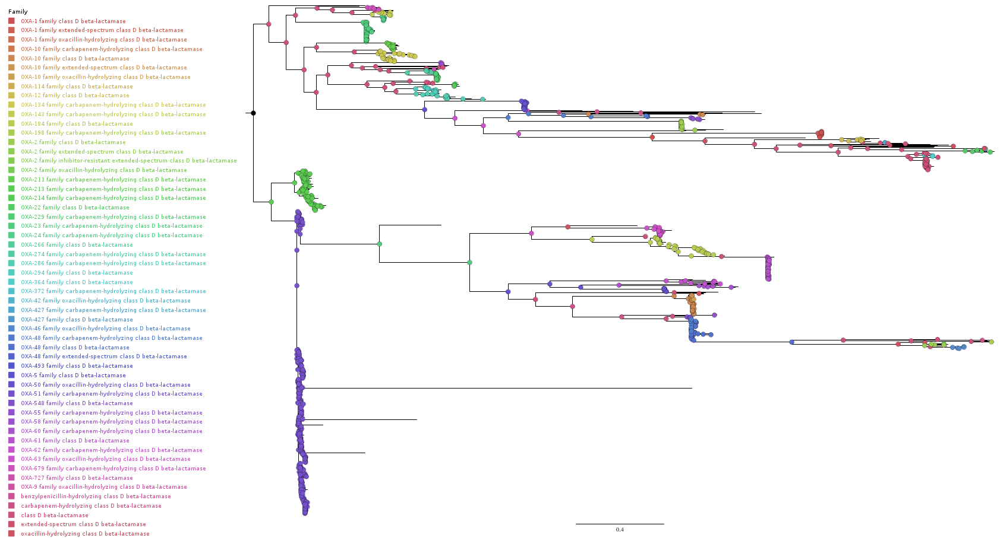

# Files summary

* `006.newnames.aln.xz`: protein alignment
* `006.newnames.iq.tre`: maximum likelihood (ML) tree estimated with IQTREE2
* `007.midpoint.tre`: ML tree rooted at the midpoint root; tree used for ancestral state reconstruction 
* `007.annotated_ncbifamily.nexus`: tree annotated with ancestral nodes (as nexus comments) 
* `008.tip_families.tsv`: table with "family from root" information, in taxonomic format

### Extra (non-essential or unused) files 
* `007.annotated_ncbifamily.csv`: table with scaled likelihoods for every state at every internal node
* `007.gotree.edges.tsv`: table with information for all edges (including inferred ancestral states) of  `007.annotated_ncbifamily.nexus`
* `007.gotree.nodes.tsv`: table with information for nodes in `007.annotated_ncbifamily.nexus`

# Detailed commands

## general alignment and NJ tree inference 
```bash
mafft --auto card_canonical_card_prev_and_ncbi_oxa_dedeup.faa > card_canonical_card_prev_and_ncbi_oxa_dedeup.aln
rapidnj -i fa -t p  card_canonical_card_prev_and_ncbi_oxa_dedeup.aln > card_canonical_card_prev_and_ncbi_oxa_dedeup.nj.tre
```

## quick-and-dirty to remove outliers  (not used)
```bash
iqtree2 -k 01.shortnames.nj.tre ## will generate a PDA file with seq names etc.
gotree stats edges -i 01.shortnames.nj.tre  | sort -nk 3  | tail -n 30 | cut -f 9 | sort | uniq >> 01.shortnames.nj.tre.pda
```
PDA file needs some editing. Then
```bash
gotree stats edges -i 01.shortnames.nj.tre  | sort -nk 3  | tail -n 30 | cut -f 9 | sort | uniq >> 01.shortnames.nj.tre.pda
mafft --ep 0.3 --auto 03.sans_longbranches.aln > 04.sans_realign.aln
```
## To remove outlier (that we found by eye from prev alignment):
```bash
goalign subset --unaligned -r -e WP_063839877 -i card_canonical_card_ncbi_oxa_dedeup.faa > dededup_minux_OXA-PR.fas 
mafft --auto --ep 0.23 dededup_minux_OXA-PR.fas > dededup_minux_OXA-PR.aln
iqtree2 -s dededup_minux_OXA-PR.aln  -m LG --ninit 2 -nt 12
```
The ML tree file will be called  `dededup_minux_OXA-PR.aln.treefile` 

## Renaming alignment sequences 
```bash
grep ">" 004.card_canonical_card_ncbi_oxa_dedeup_gaps+out_removed.aln | cut -c 2- | gawk -F '|'  '{print $2"\t"$0}' > 006.newnames.tsv
goalign rename -m 006.newnames.tsv --revert  -i 004.card_canonical_card_ncbi_oxa_dedeup_gaps+out_removed.aln > 006.newnames.aln
```

## reroot and annotate internal nodes 
```bash
gotree reroot midpoint -i ../003/006.newnames.iq.tre > 007.midpoint.tre
treetime mugration --tree 007.midpoint.tre --states ../annotations/ncbi_card_annotation_comparion/families.tsv --attribute "NCBI Family" --outdir 007.tt --confidence
mv 007.tt/annotated_tree.nexus 007.annotated_ncbifamily.nexus
mv 007.tt/confidence.csv 007.annotated_ncbifamily.csv
# alternative is to extract tree annotations with gotree
gotree stats edges -i 007.annotated_ncbifamily.nexus --format nexus > 007.gotree.edges.tsv
gotree stats nodes -i 007.annotated_ncbifamily.nexus --format nexus > 007.gotree.nodes.tsv
```



## Estimating ancestral states with PastML and traversing the tree
Notice that the ancestral reconstruction _may_ be distinct from the one in file `007.annotated_ncbifamily.nexus`
```python
import pandas as pd, ete3
from pastml.acr import acr
# read tree
tstr = open("007.midpoint.tre").readline().rstrip().replace("\'","").replace("\"","").replace("[&R]","")
tre = ete3.Tree(tstr)
# read trait to be estimated
trait = pd.read_csv("ncbi.families.tsv", sep="\t") ## this file is actually the ../annotations/...etc... metadata file
trait.set_index("Accession", drop = True, inplace = True)
trait = trait.rename(columns={"NCBI Family":"family"})
anntre = acr (tre, trait[["family"]], prediction_method = "MAP", force_joint=False, threads=12)
# traverse the tree creatig the new feature (string)
for node in tre.traverse("preorder"):
    node.longname = ""
    node.famstring = ",".join([str(i) for i in node.family])
    if (node.is_root()):
        node.longname = node.famstring
    else:
        if (node.famstring != node.up.famstring):
            node.longname = node.up.longname + ";" + node.famstring
        else:
            node.longname = node.up.longnam
# save info with in tsv 
with open ("008.tip_families.tsv","w") as fs:
    for l in tre.iter_leaves():
        print (l.name, "\t", l.longname, file=fs)
```

## Microreact visualization
[007.midpoint.tre + 002.metadata.csv](https://microreact.org/project/6V7sdy5pGdWUWfbxhBFAh9-quioxate)

